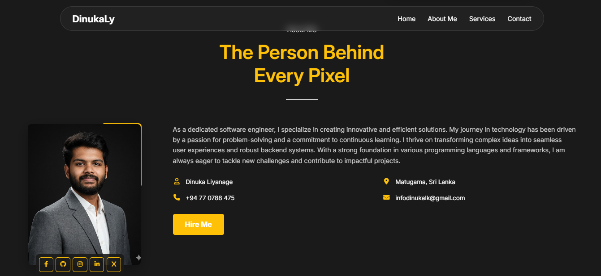
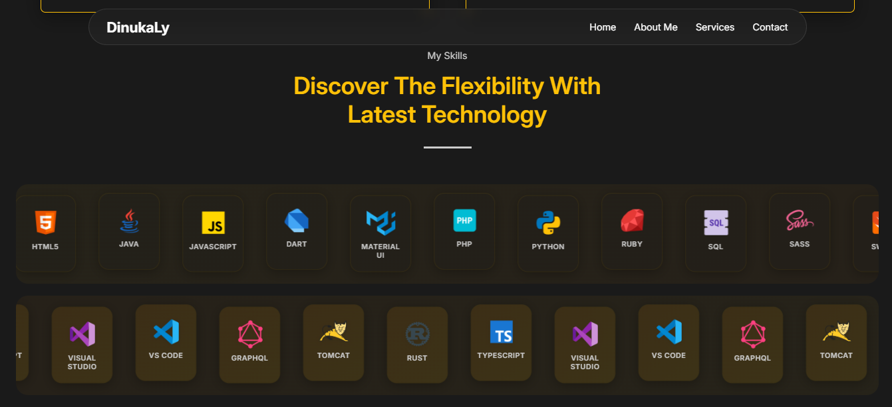

# 🚀Personal Portfolio Website

A modern, responsive portfolio website showcasing my journey as a Full Stack Developer with expertise in building robust and scalable web applications.


## 🔍 Overview

This portfolio website is designed to showcase my skills, projects, and professional journey as a Full Stack Developer. Built with modern web technologies and following best practices for responsive design, it provides an engaging user experience across all devices.

## ✨ Features

- **Modern Design**: Clean, professional layout with smooth animations
- **Fully Responsive**: Optimized for desktop, tablet, and mobile devices
- **Interactive Elements**: Hover effects, smooth scrolling, and animated skill icons
- **Modular CSS**: Well-organized stylesheet architecture
- **Performance Optimized**: Fast loading times and optimized assets
- **SEO Friendly**: Proper meta tags and semantic HTML structure

## 🛠️ Technologies Used

### Core Technologies
- **HTML5**: Semantic markup and structure
- **CSS3**: Modern styling with custom properties and animations
- **JavaScript**: Interactive functionality and DOM manipulation
- **Font Awesome**: Professional icons and symbols

### CSS Architecture
- **CSS Variables**: Custom properties for consistent theming
- **Flexbox & Grid**: Modern layout techniques
- **Media Queries**: Responsive breakpoints
- **CSS Animations**: Smooth transitions and effects

## 📁 Project Structure

```
Portfolio/
├── index.html                 # Main portfolio page
├── css/                       # Stylesheets directory
│   ├── base.css              # CSS variables, reset, typography
│   ├── layout.css            # Header, navbar, footer layouts
│   ├── components.css        # Reusable UI components
│   ├── sections.css          # Page section-specific styles
│   ├── responsive.css        # Mobile and responsive rules
│   └── main.css              # Main stylesheet importing all modules
├── assets/                   # Images and media files
│   ├── hero_image.png        # Hero section portrait
│   ├── about_image.jpg       # About section image
│   ├── lang_icons/           # Technology skill icons
│   └── [project images]      # Project screenshots
```

## 🚀 Getting Started

### Prerequisites
- A modern web browser (Chrome, Firefox, Safari, Edge)
- A text editor or IDE (VS Code recommended)
- Basic knowledge of HTML and CSS

### Installation
1. Clone or download this repository
2. Open `index.html` in your web browser
3. Or serve it using a local development server:

### Development
- Edit HTML in `index.html`
- Modify styles in the `css/` directory
- Add images to the `assets/` folder
- Update content as needed for your portfolio

## 📑 Sections

### 1. **Hero Section**
- Professional introduction
- Key statistics (Projects, Experience, Clients)
- Call-to-action button

### 2. **About Section**
- Personal background and story
- Contact information
- Social media links

### 3. **Experience Section**
- Education timeline
- Work experience
- Professional growth

### 4. **Skills Section**
- Technology stack showcase
- Animated skill icons
- Programming languages and tools

### 5. **Services/Portfolio Section**
- Project showcases
- Service offerings
- Client testimonials

### 6. **Contact Section**
- Contact form
- Professional contact details
- Social media integration

## 📱 Responsive Design

The website is fully responsive with breakpoints for:
- **Mobile**: 320px - 768px
- **Tablet**: 768px - 1024px
- **Desktop**: 1024px and above

### Responsive Features:
- Hamburger menu for mobile navigation
- Flexible grid layouts
- Optimized typography scaling
- Touch-friendly interface elements

## 🎨 CSS Architecture

The project follows a modular CSS architecture:

### **base.css**
- CSS custom properties (variables)
- CSS reset and normalization
- Typography rules
- Global styles

### **layout.css**
- Header and navigation styles
- Main layout containers
- Footer styling
- Grid and flexbox layouts

### **components.css**
- Buttons and forms
- Cards and containers
- Icons and badges
- Reusable UI elements

### **sections.css**
- Hero section styles
- About section styling
- Skills showcase
- Contact section

### **responsive.css**
- Mobile-first approach
- Breakpoint management
- Responsive utilities
- Device-specific adjustments

## 📸 Screenshots





### mobile view


## 📄 License

This project is open source and available under the [MIT License](LICENSE).

---
